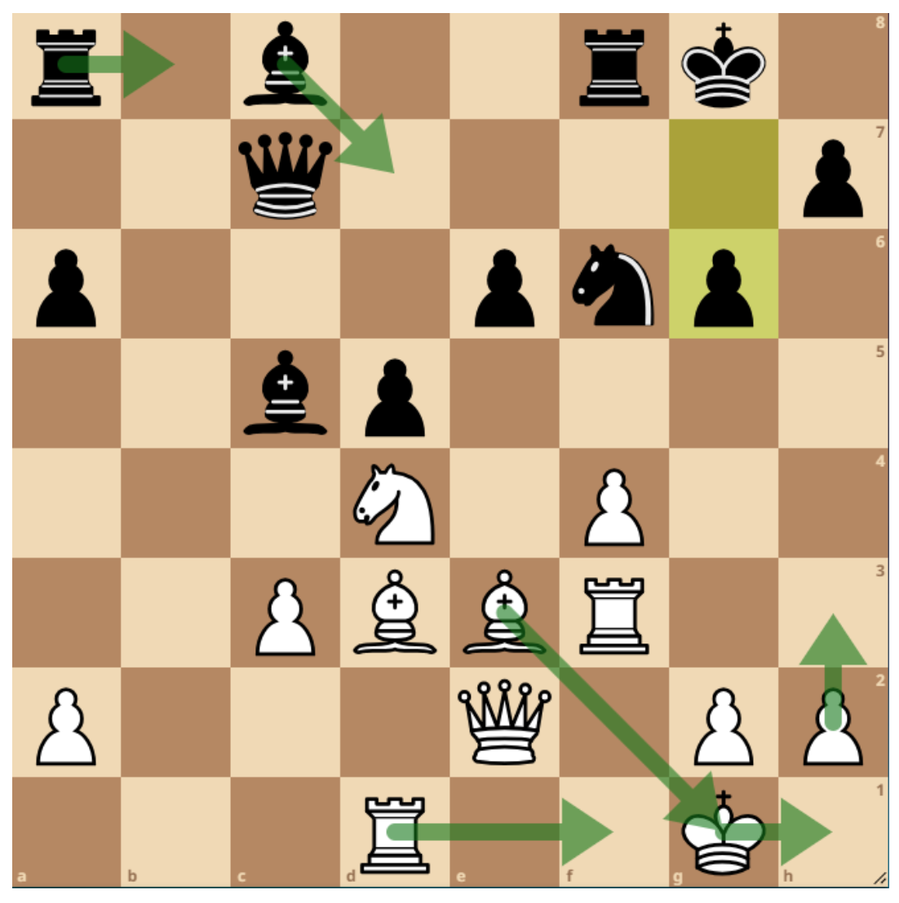
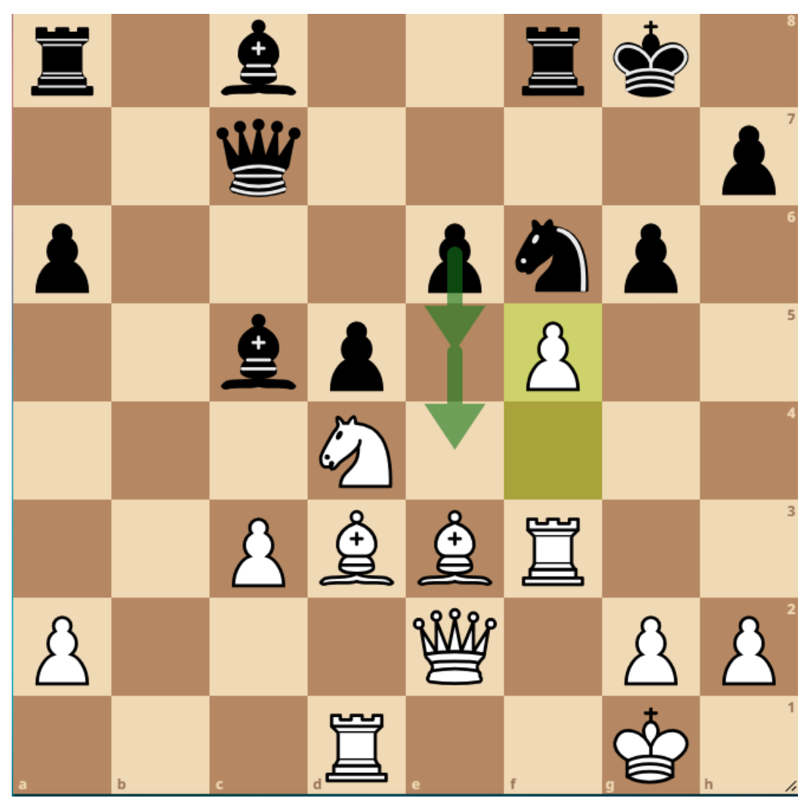
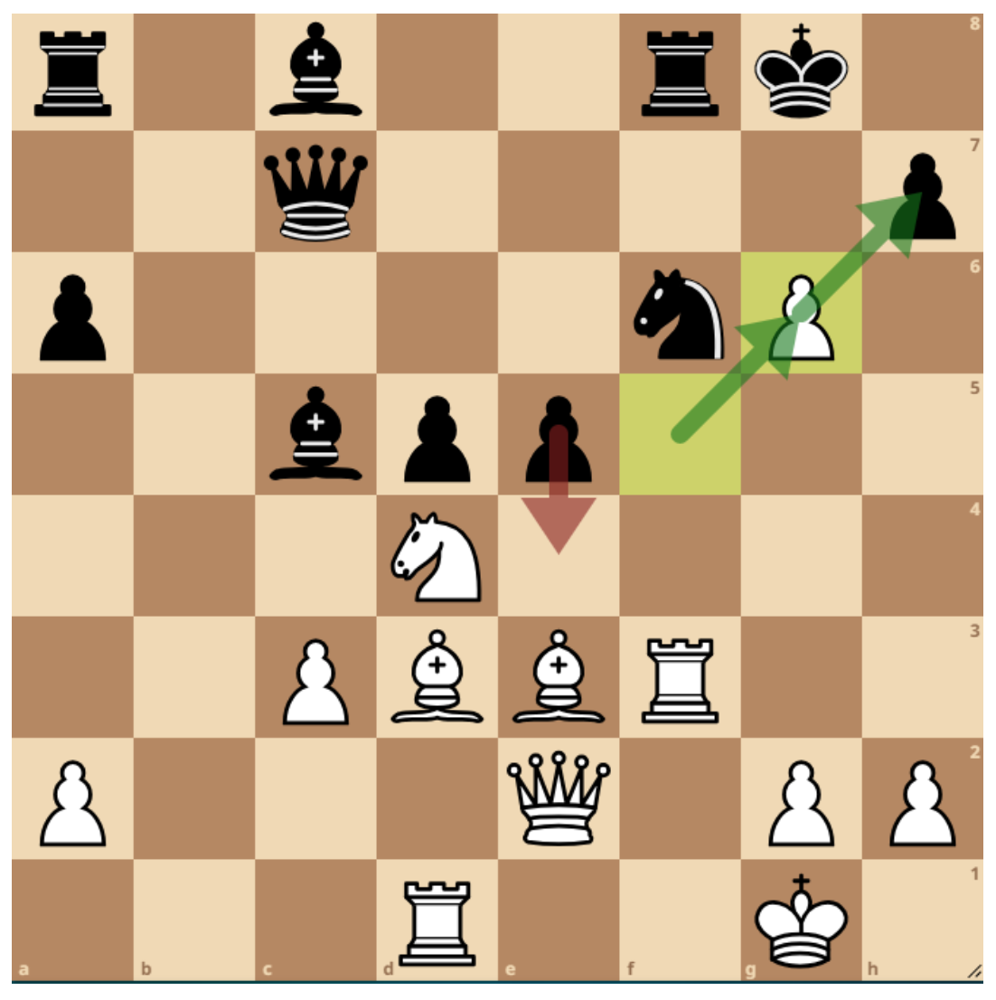
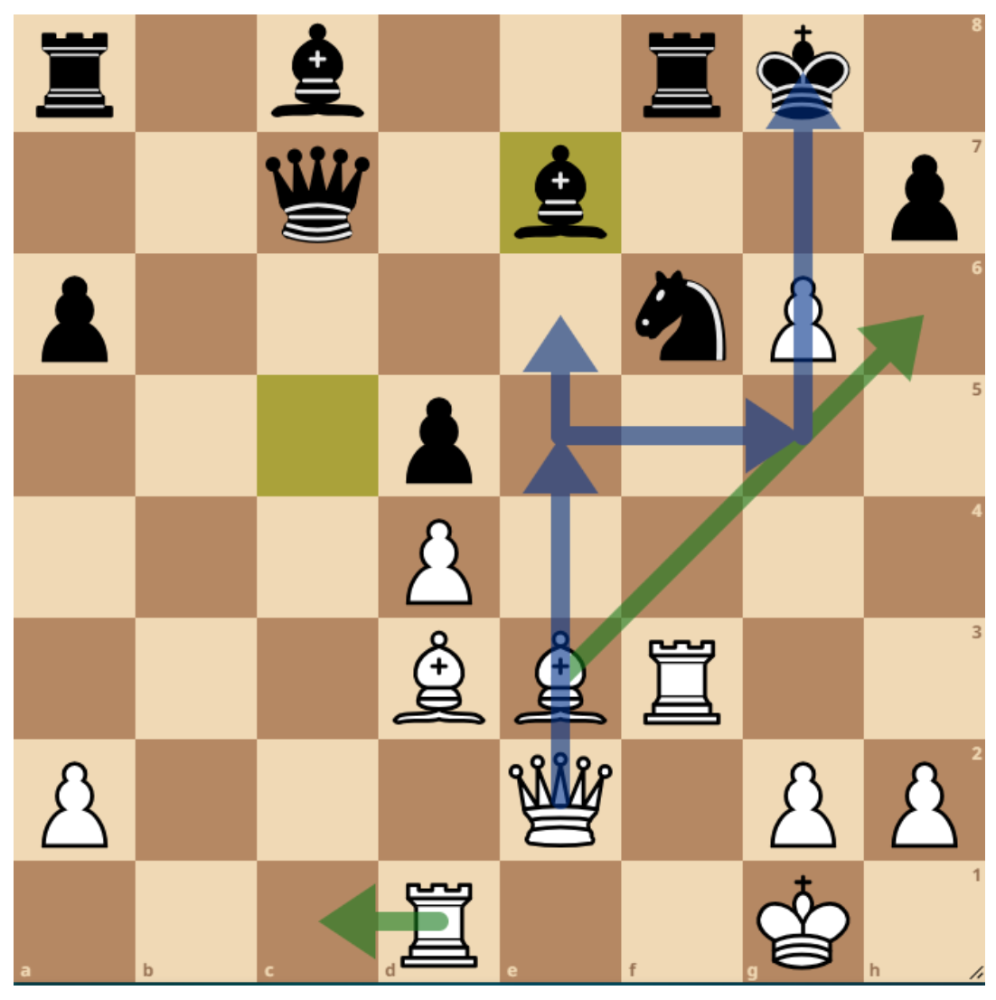
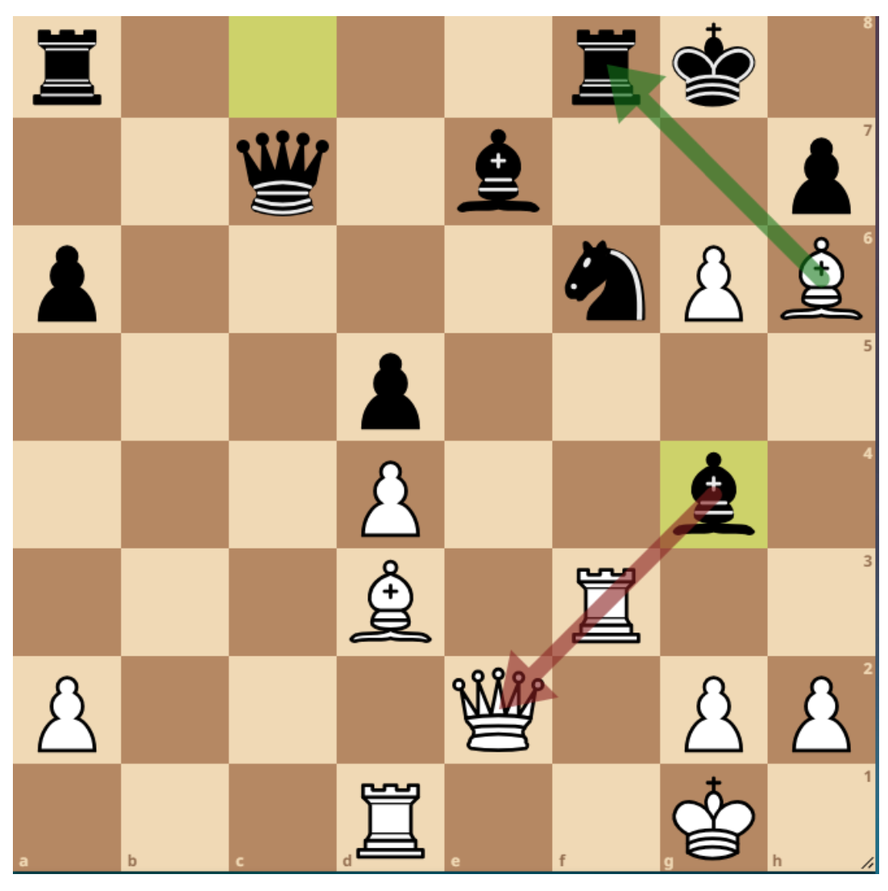
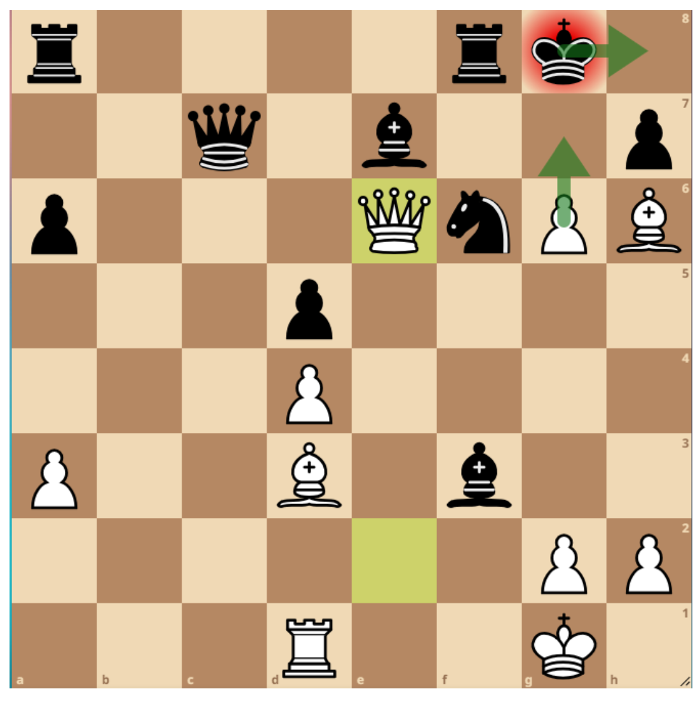
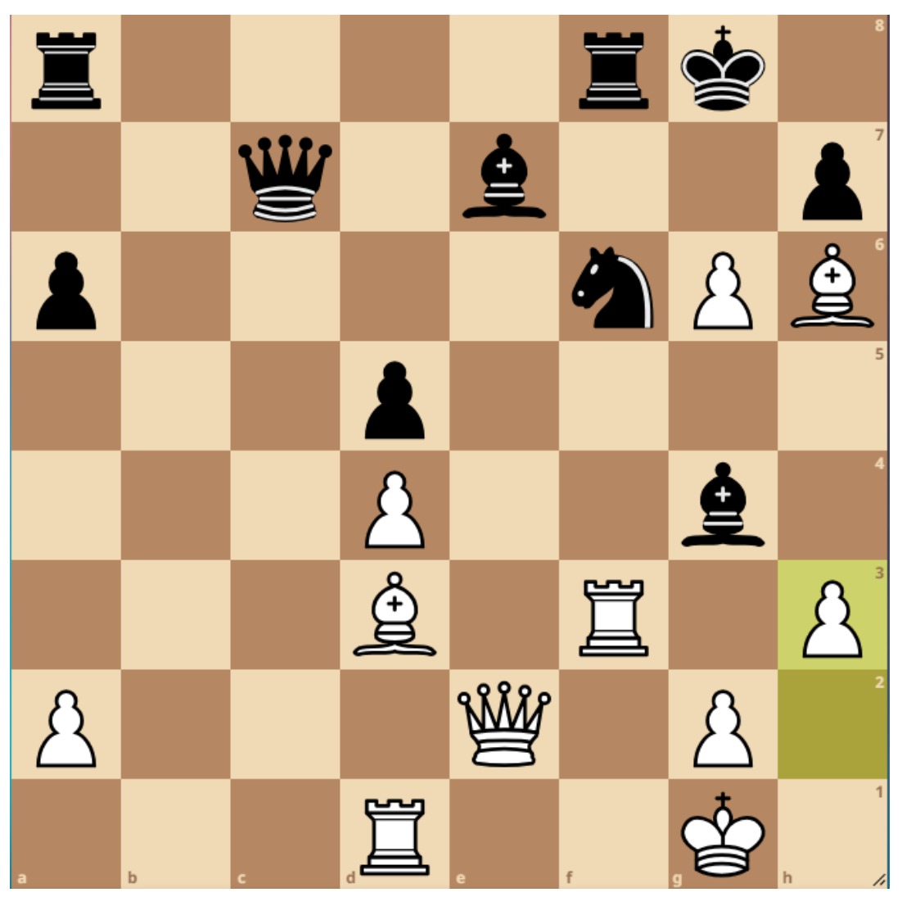
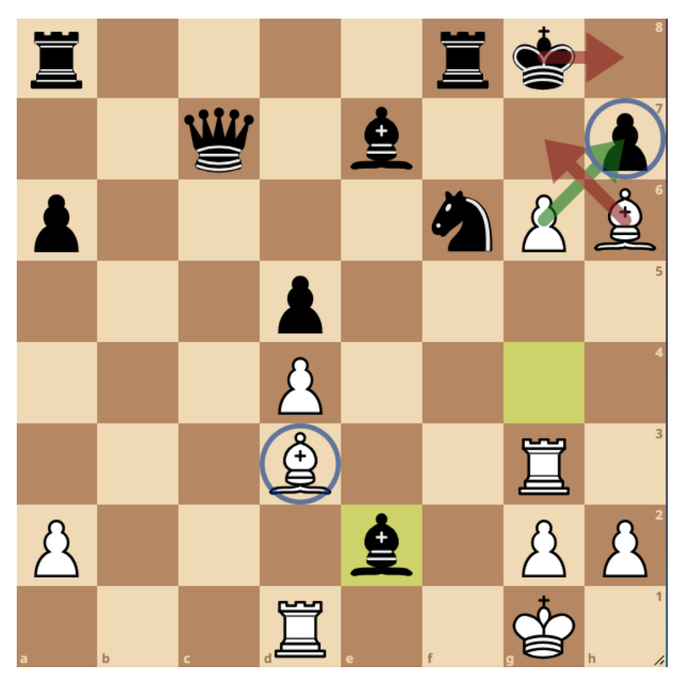
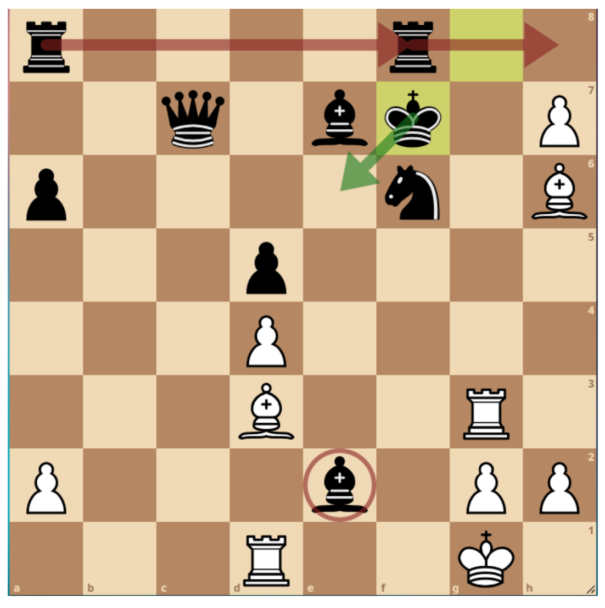
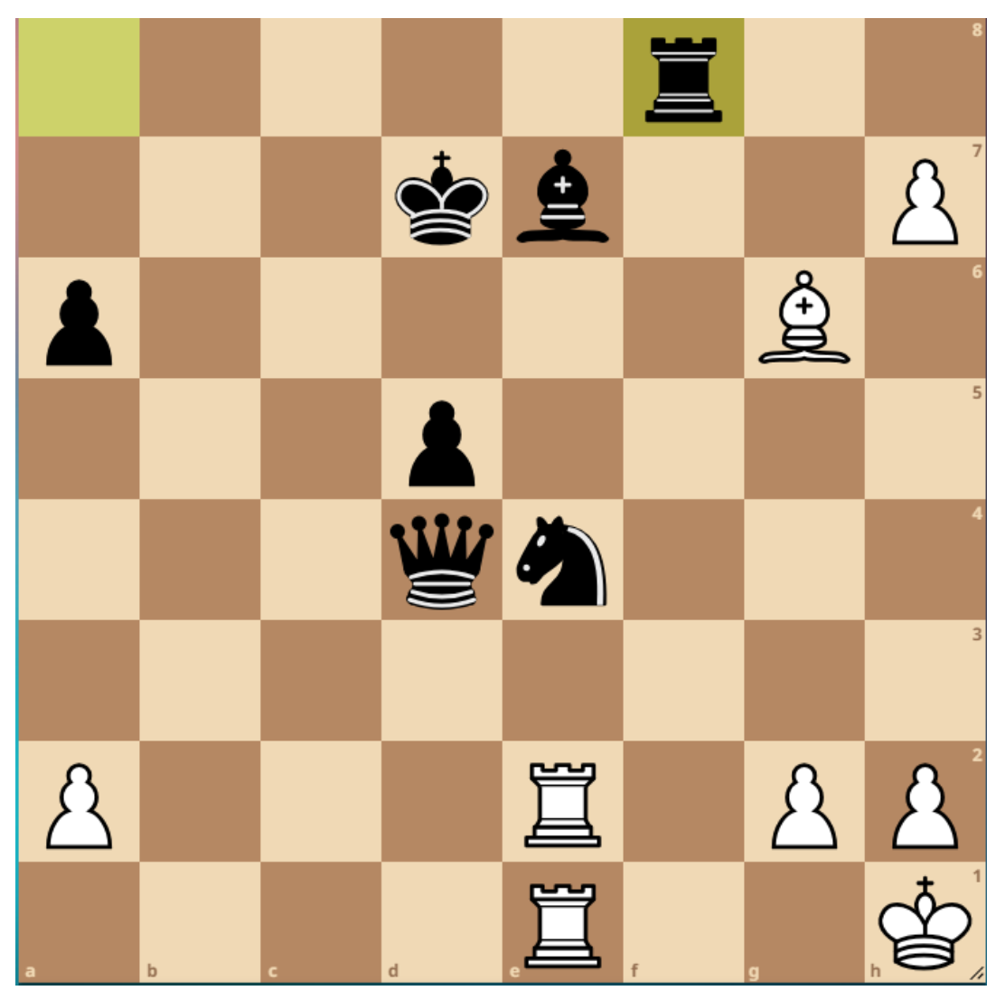

## Can you keep your cool under fire?
Maria Ciocan, October 2023

It’s October and cities around the world are embracing the autumn looks, trading in
bright colors for shades of burnt orange and crimson red. For me, October also brings
the start of a new season of the London League. 
The London Chess League is an annual team competition, split into divisions on a promotion-demotion system. This is
my second year participating, and my late evening chess matches have
become one of the things I am looking forward to every time.

So, two weeks ago somewhere in rainy London, I was headed for my first match of the
season, playing board 4 out of 8 in my team. I didn’t know what colour I was going to
play or anything about my opponent. After participating in many FIDE-rated
tournaments, such as World & European Youth Championships, I have grown
accustomed to knowing my opponent’s rating before the match. Often times I would revise my openings before the game, trying to be well-prepared against as many systems as possible, or maybe coming up with a surprise 
opening chance to confuse my opponent. In the London League, I just sit down and play, which makes the experience different, and I am still exploring the full implications of those differences. 
Anyway, my tube was delayed and I arrived at the venue 15 minutes late, starting with 60 minutes on
the clock, so I quickly developed into a classic French defense setup. Following the
typical pawn breakthroughs c5 and d4, I found myself in the following middlegame:

I was mildly discontent with my position as black. My light-squared bishop was very
limited and I had a weakness on e6.
The lichess.org engine evaluates this position as +0.6 for white, suggesting meticulous
planning to increase the pressure. The setup for white preferred by Stockfish is
highlighted on the board. Even after browsing through the best lines, I am still unclear
on precisely how white can prove their advantage. But that’s not exactly what I felt at
the board: then, I worried that white might try to break through my kingside, with a well-
timed f4-f5 or h4-h5.
Yet, I was happy I had a solid lead on the clock: 20 minutes against 10. There was little
chance of flagging, thanks to the 15 seconds increment. But I know from experience
that when you see the seconds scrolling down the digital clock, you feel stressed and
are way more likely to blunder. So, I was hoping the time pressure would make my
opponent take a wrong turn. Plus, I felt I had two easy moves ahead of me: Rb8 and
Bd7, simply improving those pieces.
My opponent took me by surprise:

White pushed f4-f5, a fairly aggressive move that threatens to take on g6. A move
before (see diagram above), I had thought about white pushing f5. I felt confidently
about responding with e5 so I dismissed that move for white.
But seeing it played on the board forced me to explore the f takes g6 scenario:

The cool thing about black’s e5 is that it doesn’t just attack the knight, but also threatens
a fork on e4 next move. Basically, white loses a minor one way or another. So instead of
Can you keep your cool under fire? 4
salvaging the knight, white captures on g6 and fights to establish compensation for the
lost piece through the pressure on black’s kingside.
At this point, my opponent had used up most of his time calculating and I was feeling
uneasy. I grabbed the knight on d4 thinking that from this point, I only need to prove his
attack isn’t working and I keep the extra material. My opponent took two pawns for the
knight, but I thought that in the event of a queens’ trade, having an extra minor piece
would allow me to capture those pawns back.
After he recaptured on d4 and I retreated the bishop, I realised white had much more
dynamic play than I had anticipated:

Black should not forget that g takes h7 is just lurking in the background. The pressure of
white’s heavy pieces on the open files, combined with the strength of the bishop pair,
makes up much more than a pawn.
In fact, just one move later, I made a critical mistake, responding to Bh6 with Bg4:

I was now down to 30 seconds, just like my opponent, and I felt that the game was
about to be decided momentarily. My go-to next move was taking the rook on f3. But I
was missing something huge in this position: that black should absolutely not capture
the rook on f3 next move.
With no one left to cover e6, the white queen scoops in to deliver a cute checkmate:

The best move for white after Bg4 is the quiet and efficient h3:

Since Bishop takes f3 leads to checkmate, black has to retreat. White’s pressure simply
resumes, the first black piece to fall probably being the rook on f8.
But instead of h3, the last thing that you want to see when you’re down to thirty seconds
happened: a queen sacrifice!
My suspicious frowned turned into a worried one as I found my opponent’s fantastic
checkmate idea:

I started calculating Q takes g3 instead, hoping to take on e2 after white takes on g3
and simplify to an endgame. But white has the powerful Q takes e7, and the threat of
Qg7 checkmate is crushing.
The clock was now close to ten seconds, and I reconsidered the B takes e2
continuation. It’s frustrating to see a hanging queen and be unable to take it. That’s
when I finally found it:

King to f7! In my earlier calculation, I had missed the king’s escape to f7 and then e6 (if
it wasn’t for e6, white would have Bg6 checkmate). But king to f7 puts an end to white’s
mating net and even though black’s position is completely uncoordinated, my material
advantage is just too big. Since I’m a queen up, I can offer back part of my material to
cool things down, and still be up afterwards. As the thought was forming in my head, my
hand quickly pushed the king to f7.
Relief took over my body and the game didn’t last much longer. Below is the final
position:

We shook hands and I headed home feeling happy.

When analyzing your own games, it’s important to keep in mind that lines always feel
more convincing when they are coming with an evaluation bar on the side of the board.
When one has to play defensively, it is not unlikely for a player to overestimate the
attacking prospects or miss an opportunity to switch to offense. Those are things that an
engine wouldn’t miss. One exercise that I find useful is playing moves for my opponent,
and see how the engine refutes the same lines I was worried about in the game. It’s
important to translate the eval score to your own understanding of the game, and also
know when to cut yourself some slack.

Thanks for making it to the end of the analysis, and let me know in the comments how
you deal with your opponents’ blunt attacks.