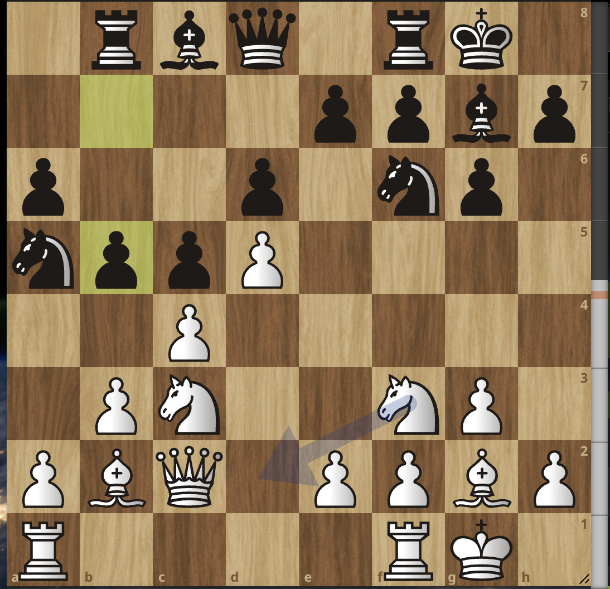

# I won a rapid tournament! 

We are all overly familiar with all the heartbreak and frustration chess can incur in even the most calm & collected players 😅. But today I want to boast about the satisfaction of winning a game with a fiery tactic or a skillful strategic play, about the pride of seeing your name at the top of the leaderboard ... 

Last weekend, I played the [Ealing FIDE Rapid Play](https://londonfidecongress.com/ealing-rapidplay) tournament in West London. The format was 6 rounds, one after another, with a time control of 15 minutes + 5 seconds increment. It was a sunny but chilly day, and the playing venue was conveniently located close to a few stores, coffee shops, as well as one of my favorite bakeries, Gail's. Things were off to a promising sun as I got to enjoy a coffee & a pastry under the sun. 

But I did not have high expectations around the outcome of the tournament. I rarely play rapid over the board, so I often feel like classical chess is the only one I care about when it comes to my performance. I can't help but think about the viral Dubov moment and find that, in a hilarious way, he has a point. Rapid is tricky to play - you can't go too in depth in a position because you risk getting into unescapable time trouble, but you also can't rush through your moves because if you make a mistake, your opponent will have time to spot it. 
But rapid can also be a lot of fun, especially for more experienced players. You get to trust your gut more, play more based on vibes 😂. And if you land in positions where you're familiar with the key ideas and plans, you have a great advantage over your opponent. 

### Round 1 

I started the tournament facing one of the least desirable opponents to have: a boy born in 2017 🤯. Don't get me wrong, children are adorable. But also often underrated! 
We reached the following position after one of the main lines in the King's Indian, The Fianchetto Variation: 

He played very fast until here, indicating that he knew the line. (Sidenote, you are not required to write down your moves in rapid, so I didn't. I had to harvest my short term memory to recollect the games - at least this one was pretty easy because it is well-known territory until here.) Black is threatening to take on c4, which is why the computer's arrow is suggesting Nd2 for White. But my opponent went for a wrong turn: he took on b5 and played a3: 

  <iframe src="https://lichess.org/study/embed/Tg49Ncfa/AOMuzLMu"
          style="position: absolute; top: 0; left: 0; width: 100%; height: 100%;"
          frameborder="0">
  </iframe>

